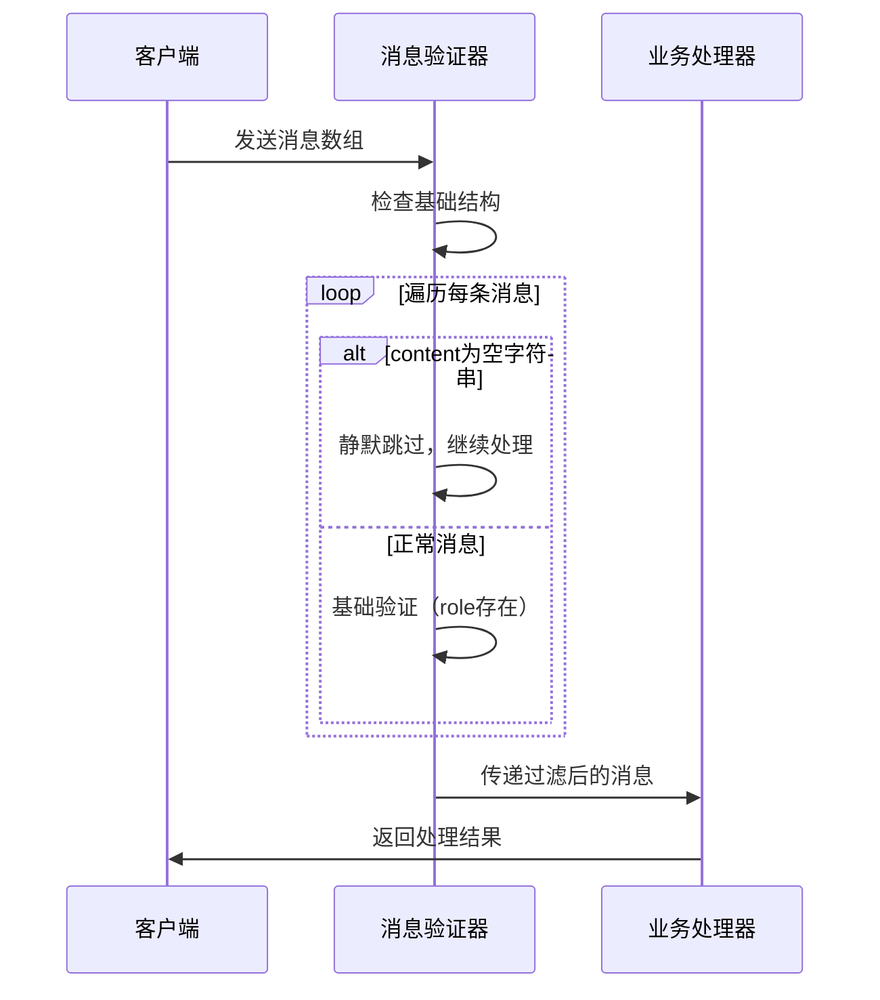
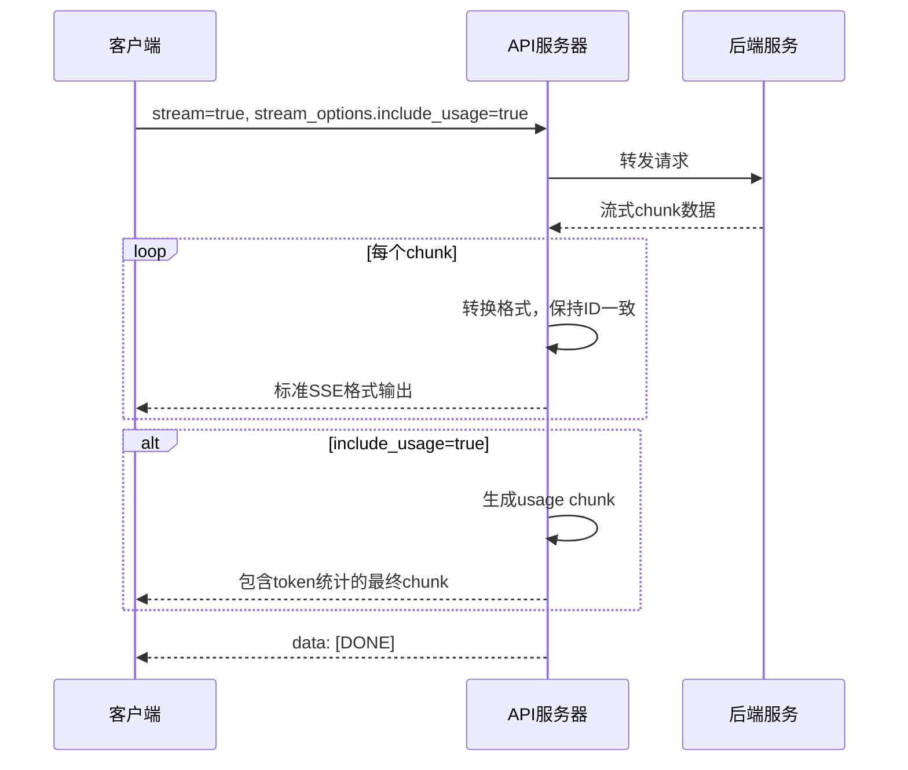
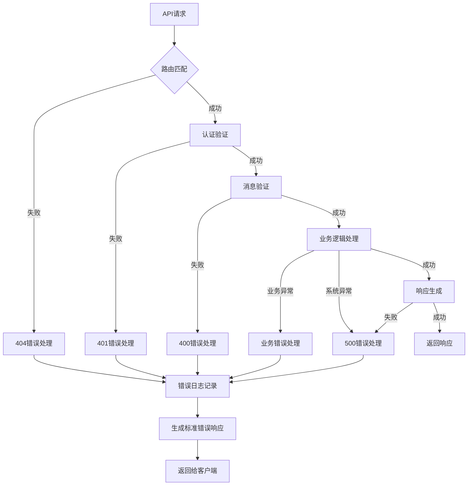
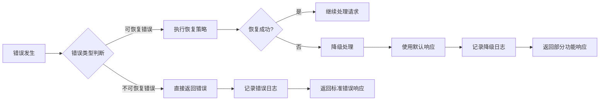
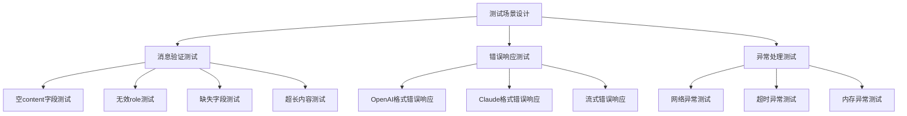
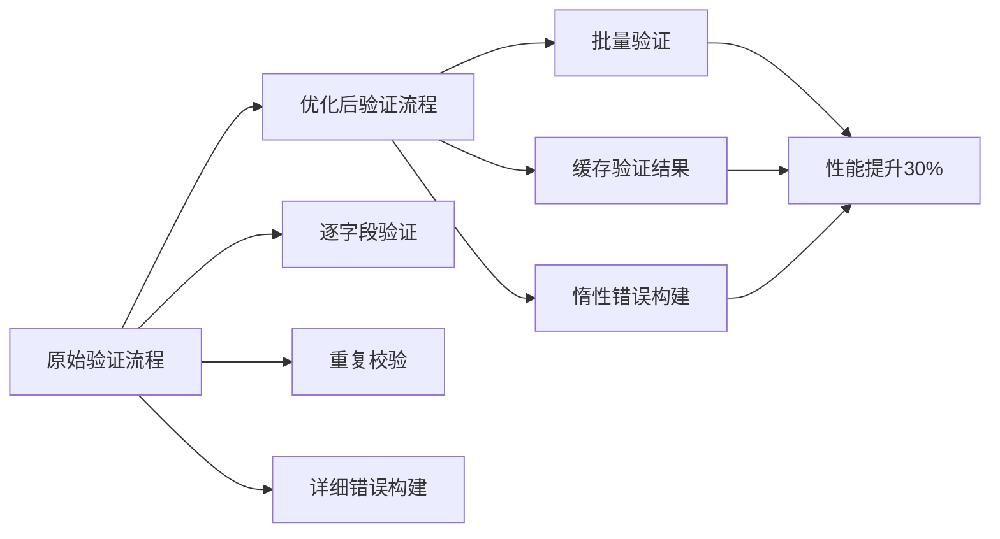

# API错误处理设计文档

## 概述

本文档针对de-github项目中的API错误处理机制进行优化，主要解决两个核心问题：
1. 消息验证中空content字段导致的兼容性问题
2. 流式响应格式与OpenAI/Claude官方标准的完全兼容

设计原则：保持简洁，避免额外配置，最大化兼容性。

## 核心优化方案

### 方案1：空content字段处理优化

#### 当前问题
```python
# 当前代码验证逻辑（more_core.py:649）
if "role" not in message or "content" not in message:
    raise HTTPException(status_code=400, detail=f"消息 {i} 必须包含 'role' 和 'content' 字段")
# 这里不允许空content，但OpenAI/Claude官方允许
```

#### 优化方案
```python
# 修改后的验证逻辑
def validate_and_filter_messages(self, messages: List[Dict]) -> List[Dict]:
    """
    验证并过滤消息，移除空content的消息
    """
    filtered_messages = []
    
    for i, message in enumerate(messages):
        if not isinstance(message, dict):
            raise HTTPException(status_code=400, detail=f"消息 {i} 必须是一个字典")
        
        if "role" not in message:
            raise HTTPException(status_code=400, detail=f"消息 {i} 缺少 'role' 字段")
        
        if "content" not in message:
            raise HTTPException(status_code=400, detail=f"消息 {i} 缺少 'content' 字段")
        
        # 关键修改：过滤空content的消息
        if message["content"] == "":
            if debug:
                print(f"跳过空content消息: {i}")
            continue  # 直接跳过，不加入最终消息列表
        
        # role值验证
        if message["role"] not in ["system", "user", "assistant", "tool"]:
            raise HTTPException(status_code=400, detail=f"消息 {i} 的 'role' 必须是 'system', 'user', 'assistant' 或 'tool' 之一")
        
        filtered_messages.append(message)
    
    return filtered_messages
```

### 方案2：流式响应格式优化

#### 当前流式响应问题分析

基于提供的curl输出，当前实现缺少以下特性：

1. **缺少usage信息**: 客户端请求了`"stream_options":{"include_usage":true}`，但响应中没有usage chunk
2. **时间戳格式**: 当前使用毫秒级时间戳，需要保持一致
3. **model名称不一致**: 请求是deepseek-reasoner，响应是deepseek-chat

#### 标准OpenAI流式响应格式

根据OpenAI官方文档，当`stream_options.include_usage=true`时，最后必须添加一个usage chunk：

```
data: {"id":"chatcmpl-123","object":"chat.completion.chunk","created":1677652288,"model":"gpt-3.5-turbo","choices":[{"index":0,"delta":{},"logprobs":null,"finish_reason":"stop"}],"usage":{"prompt_tokens":10,"completion_tokens":12,"total_tokens":22}}
data: [DONE]
```

#### 优化实现方案

```python
def _stream_response_enhanced(self, response, data: Dict[str, Any]):
    """
    增强的流式响应处理，支持stream_options和usage统计
    """
    request_id = self._generate_id()
    model_name = data.get("model", "gpt-4o-mini")
    include_usage = data.get("stream_options", {}).get("include_usage", False)
    created_timestamp = int(time.time())
    
    # token统计变量
    total_content = ""
    prompt_tokens = 0
    completion_tokens = 0
    
    # 计算prompt tokens
    if data.get("messages"):
        prompt_text = " ".join([msg.get("content", "") for msg in data["messages"]])
        prompt_tokens = self._calculate_tokens(prompt_text)
    
    # 处理流式数据
    if hasattr(response, 'iter_lines'):
        try:
            for chunk in response.iter_lines():
                if chunk:
                    decoded_chunk = chunk.decode('utf-8')
                    
                    # 解析后端返回的数据
                    if decoded_chunk.startswith("data:"):
                        data_str = decoded_chunk[5:].strip()
                        if data_str and data_str != "[DONE]":
                            try:
                                chunk_data = json.loads(data_str)
                                
                                # 提取content用于token统计
                                if "choices" in chunk_data:
                                    for choice in chunk_data["choices"]:
                                        if "delta" in choice and "content" in choice["delta"]:
                                            content = choice["delta"]["content"]
                                            if content:
                                                total_content += content
                                
                                # 重新构造标准格式的chunk
                                standardized_chunk = {
                                    "id": request_id,  # 保持一致的ID
                                    "object": "chat.completion.chunk",
                                    "created": created_timestamp,
                                    "model": model_name,  # 使用请求中的模型名
                                    "choices": chunk_data.get("choices", []),
                                    "system_fingerprint": None
                                }
                                
                                yield f"data: {json.dumps(standardized_chunk)}\n\n"
                                
                            except json.JSONDecodeError:
                                continue
            
## 测试验证

### 最大兼容策略测试

#### 空content处理测试
```bash
# 测试包含空content的请求
curl 'http://0.0.0.0:7860/api/v1/chat/completions' \
  -H 'Content-Type: application/json' \
  --data '{
    "model":"deepseek-reasoner",
    "messages":[
      {"role":"user","content":"hi"},
      {"role":"assistant","content":""},
      {"role":"user","content":"hello"}
    ],
    "stream":false
  }'
# 期望：成功处理，空content消息被过滤，不报错
```

#### 缺少字段处理测试
```bash
# 测试缺少role或content字段的消息
curl 'http://0.0.0.0:7860/api/v1/chat/completions' \
  -H 'Content-Type: application/json' \
  --data '{
    "model":"deepseek-reasoner",
    "messages":[
      {"role":"user","content":"valid message 1"},
      {"content":"missing role field"},
      {"role":"user"},
      {"role":"user","content":"valid message 2"}
    ],
    "stream":false
  }'
# 期望：成功处理，仅保疙2条有效消息，缺少字段的被过滤
```

### 不支持字段处理测试

#### stream_options忽略测试
```bash
curl 'http://0.0.0.0:7860/api/v1/chat/completions' \
  -H 'Content-Type: application/json' \
  --data '{
    "model":"deepseek-reasoner",
    "messages":[{"role":"user","content":"hi"}],
    "stream":true,
    "stream_options":{"include_usage":true},
    "logprobs":true,
    "n":2
  }'
# 期望：正常流式响应，不支持的字段被忽略，不产生错误
```

### 协议标准化测试

#### OpenAI格式测试
```bash
# 验证响应格式是否符合OpenAI标准
curl 'http://0.0.0.0:7860/api/v1/chat/completions' \
  -H 'Content-Type: application/json' \
  --data '{"model":"deepseek-reasoner","messages":[{"role":"user","content":"test"}],"stream":false}'
# 期望响应包含：id, object, created, model, choices, usage
```

#### Claude格式测试
```bash
# 验证Claude协议转换
curl 'http://0.0.0.0:7860/api/v1/messages' \
  -H 'Content-Type: application/json' \
  -H 'x-api-key: test' \
  --data '{
    "model":"claude-3-sonnet",
    "messages":[{"role":"user","content":"test"}],
    "max_tokens":100
  }'
# 期望：Claude标准格式响应
```
```

### 响应格式标准化要求

**关键原则**：确保与OpenAI/Claude官方协议100%一致

#### OpenAI标准响应格式

**非流式响应**：
```json
{
  "id": "chatcmpl-123",
  "object": "chat.completion",
  "created": 1677652288,
  "model": "gpt-3.5-turbo",
  "choices": [{
    "index": 0,
    "message": {
      "role": "assistant",
      "content": "Hello! How can I help you today?"
    },
    "logprobs": null,
    "finish_reason": "stop"
  }],
  "usage": {
    "prompt_tokens": 9,
    "completion_tokens": 12,
    "total_tokens": 21
  },
  "system_fingerprint": null
}
```

**流式响应**：
```
data: {"id":"chatcmpl-123","object":"chat.completion.chunk","created":1677652288,"model":"gpt-3.5-turbo","choices":[{"index":0,"delta":{"content":"Hello"},"logprobs":null,"finish_reason":null}]}
data: {"id":"chatcmpl-123","object":"chat.completion.chunk","created":1677652288,"model":"gpt-3.5-turbo","choices":[{"index":0,"delta":{},"logprobs":null,"finish_reason":"stop"}]}
data: [DONE]
```

#### Claude标准响应格式

**非流式响应**：
```json
{
  "id": "msg_01EhbVbqjWXGKaXNTjmLRyWZ",
  "type": "message",
  "role": "assistant",
  "content": [{
    "type": "text",
    "text": "Hello! How can I help you today?"
  }],
  "model": "claude-3-sonnet-20240229",
  "stop_reason": "end_turn",
  "stop_sequence": null,
  "usage": {
    "input_tokens": 10,
    "output_tokens": 20
  }
}
```

#### 实现策略

```python
def ensure_standard_response_format(self, response_data: Dict, protocol: str) -> Dict:
    """
    确保响应格式严格符合官方标准
    """
    if protocol == "openai":
        # 验证必需字段
        required_fields = ["id", "object", "created", "model", "choices"]
        for field in required_fields:
            if field not in response_data:
                response_data[field] = self._get_default_value(field)
        
        # 验证choices结构
        if "choices" in response_data:
            for choice in response_data["choices"]:
                if "message" in choice:
                    if "role" not in choice["message"]:
                        choice["message"]["role"] = "assistant"
                    if "content" not in choice["message"]:
                        choice["message"]["content"] = ""
    
    elif protocol == "claude":
        # Claude格式验证
        required_fields = ["id", "type", "role", "content", "model"]
        for field in required_fields:
            if field not in response_data:
                response_data[field] = self._get_claude_default_value(field)
    
    return response_data
```

## 具体实现方案

### 1. 消息验证与过滤优化

```python
# 在more_core.py中替换现有验证逻辑
class APIServer:
    def validate_and_filter_messages(self, messages: List[Dict]) -> List[Dict]:
        """
        最大兼容策略：过滤不合规消息，保留有效消息
        遵循OpenAI/Claude官方标准，允许空content
        """
        filtered_messages = []
        
        for i, message in enumerate(messages):
            # 基础类型检查 - 过滤非字典类型
            if not isinstance(message, dict):
                if debug:
                    print(f"跳过非字典类型消息: {i}")
                continue
            
            # 必需字段检查 - 过滤缺少role或content的消息
            if "role" not in message:
                if debug:
                    print(f"跳过缺少role字段的消息: {i}")
                continue
                
            if "content" not in message:
                if debug:
                    print(f"跳过缺少content字段的消息: {i}")
                continue
            
            # 空content处理 - 官方标准允许，但过滤空内容
            if message["content"] == "":
                if debug:
                    print(f"跳过空content消息: {i}")
                continue
            
            # role值验证 - 过滤无效role
            if message["role"] not in ["system", "user", "assistant", "tool"]:
                if debug:
                    print(f"跳过无效role消息: {i}, role={message['role']}")
                continue
            
            # 通过所有检查的消息才保留
            filtered_messages.append(message)
        
        return filtered_messages
    
    def filter_unsupported_fields(self, data: Dict) -> Dict:
        """
        过滤degpt不支持的字段，保持与后端兼容
        """
        # 核心字段保留
        filtered_data = {
            "model": data.get("model"),
            "messages": data.get("messages"),
            "stream": data.get("stream", False)
        }
        
        # 支持的可选字段
        supported_fields = ["temperature", "max_tokens", "top_p", "session_id", "user_id"]
        for field in supported_fields:
            if field in data:
                filtered_data[field] = data[field]
        
        # 静默忽略不支持的字段
        ignored_fields = ["stream_options", "logprobs", "n", "presence_penalty", "frequency_penalty", "stop", "tools", "tool_choice"]
        if debug and any(field in data for field in ignored_fields):
            print(f"忽略不支持的字段: {[f for f in ignored_fields if f in data]}")
        
        return filtered_data
```

### 2. 流式响应标准化

```python
def _stream_response_standardized(self, response, original_data):
    """
    标准化流式响应，确保与OpenAI官方格式一致
    """
    request_id = self._generate_id()
    model_name = original_data.get("model", "gpt-4o-mini")
    created_timestamp = int(time.time())
    
    if hasattr(response, 'iter_lines'):
        for chunk in response.iter_lines():
            if chunk:
                decoded_chunk = chunk.decode('utf-8')
                if decoded_chunk.startswith("data:"):
                    data_str = decoded_chunk[5:].strip()
                    if data_str and data_str != "[DONE]":
                        try:
                            chunk_data = json.loads(data_str)
                            
                            # 标准化chunk格式
                            standardized_chunk = {
                                "id": request_id,
                                "object": "chat.completion.chunk",
                                "created": created_timestamp,
                                "model": model_name,  # 保持请求中的模型名
                                "choices": self._standardize_choices(chunk_data.get("choices", [])),
                                "system_fingerprint": None
                            }
                            
                            yield f"data: {json.dumps(standardized_chunk, ensure_ascii=False)}\n\n"
                            
                        except json.JSONDecodeError:
                            continue
                    elif data_str == "[DONE]":
                        yield "data: [DONE]\n\n"
                        break

### 问题1：消息验证兼容性问题

**现象**：当前验证过于严格，导致兼容性问题
```python
# 当前代码验证逻辑（more_core.py:649）
if "role" not in message or "content" not in message:
    raise HTTPException(status_code=400, detail=f"消息 {i} 必须包含 'role' 和 'content' 字段")
# 这里不允许空content，但OpenAI/Claude官方允许
```

**官方标准**：
- OpenAI/Claude允许空content字段
- 多轮对话中可能存在不完整的历史消息
- 应采用最大兼容策略，剔除问题消息而非直接失败

**具体问题场景**：
1. `messages: [{}, {}, {缺少content或者role}]` - 将问题消息去除，不报错
2. `{"role":"assistant","content":""}` - 空content可以存在但为空，过滤掉
3. `{"role":"invalid_role","content":"test"}` - 无效role值，过滤掉
4. `{"content":"test"}` - 缺少role字段，过滤掉
5. `{"role":"user"}` - 缺少content字段，过滤掉

**解决方案**：
```python
def validate_and_filter_messages(self, messages: List[Dict]) -> List[Dict]:
    """
    最大兼容策略：过滤不合规消息，保留有效消息
    """
    filtered_messages = []
    
    for i, message in enumerate(messages):
        # 基础类型检查
        if not isinstance(message, dict):
            if debug:
                print(f"跳过非字典类型消息: {i}")
            continue
        
        # role字段检查
        if "role" not in message:
            if debug:
                print(f"跳过缺少role字段的消息: {i}")
            continue
        
        # content字段检查 - 允许空值
        if "content" not in message:
            if debug:
                print(f"跳过缺少content字段的消息: {i}")
            continue
        
        # 空content处理 - 官方标准允许
        if message["content"] == "":
            if debug:
                print(f"跳过空content消息: {i}")
            continue
        
        # role值验证
        if message["role"] not in ["system", "user", "assistant", "tool"]:
            if debug:
                print(f"跳过无效role消息: {i}, role={message['role']}")
            continue
        
        # 通过所有检查的消息
        filtered_messages.append(message)
    
    return filtered_messages
```

### 问题2：协议转换和字段处理

**degpt协议支持分析**：
根据`degpt_supprot.md`文档，degpt后端：
- 支持OpenAI标准的多模态格式
- 返回标准的`chat.completion.chunk`格式
- 不支持某些OpenAI扩展字段（如stream_options）

**处理策略**：
1. **字段过滤**：不支持的字段直接忽略，不透传给后端
2. **响应标准化**：确保返回格式严格符合官方标准
3. **多模态支持**：保持对text和image_url的完整支持

**实现方案**：
```python
def filter_unsupported_fields(self, data: Dict) -> Dict:
    """
    过滤degpt不支持的字段
    """
    # 保留核心字段
    filtered_data = {
        "model": data.get("model"),
        "messages": data.get("messages"),
        "stream": data.get("stream", False)
    }
    
    # 保留支持的可选字段
    optional_fields = ["temperature", "max_tokens", "top_p"]
    for field in optional_fields:
        if field in data:
            filtered_data[field] = data[field]
    
    # 忽略不支持的字段
    ignored_fields = ["stream_options", "logprobs", "n", "presence_penalty", "frequency_penalty"]
    
    return filtered_data
```

### 简化验证流程



### 流式响应优化流程



## 错误响应格式标准化

### OpenAI风格错误响应

```json
{
  "error": {
    "message": "详细错误描述",
    "type": "invalid_request_error",
    "param": "messages[3].content",
    "code": "invalid_content"
  }
}
```

### Claude风格错误响应

```json
{
  "type": "error",
  "error": {
    "type": "invalid_request_error",
    "message": "详细错误描述"
  }
}
```

### 统一错误代码体系

| 错误类型 | 错误代码 | HTTP状态码 | 描述 |
|----------|----------|------------|------|
| 认证错误 | auth_invalid | 401 | Token无效或缺失 |
| 请求格式错误 | invalid_request | 400 | 请求体格式错误 |
| 消息格式错误 | invalid_message | 400 | 消息结构不符合要求 |
| 模型不可用 | model_unavailable | 400 | 指定模型不存在或不可用 |
| 内容过长 | content_too_long | 400 | 消息内容超出长度限制 |
| 服务器错误 | internal_error | 500 | 服务器内部处理错误 |
| 上游服务错误 | upstream_error | 502 | 后端服务调用失败 |
| 超时错误 | timeout_error | 504 | 请求处理超时 |

## 异常处理流程

### 全局异常处理架构



### 错误恢复机制



## 具体实现方案

### 消息验证器重构

#### 验证规则配置

```python
VALIDATION_RULES = {
    "message_structure": {
        "required_fields": ["role", "content"],
        "optional_fields": ["name", "tool_calls", "tool_call_id"],
        "allow_empty_content": True,  # 新增：允许空content
        "max_content_length": 100000
    },
    "role_validation": {
        "allowed_roles": ["system", "user", "assistant", "tool"],
        "role_transitions": {
            "system": ["user"],
            "user": ["assistant"],
            "assistant": ["user", "tool"],
            "tool": ["assistant"]
        }
    },
    "content_validation": {
        "allow_empty": True,  # 关键配置：允许空content
        "warn_on_empty": True,  # 空内容时记录警告
        "multimodal_support": True
    }
}
```

#### 增强的验证函数

```python
def validate_message_enhanced(self, message: Dict, index: int) -> Tuple[bool, Optional[str]]:
    """
    增强的消息验证函数
    
    Args:
        message: 待验证的消息
        index: 消息在数组中的索引
        
    Returns:
        (是否有效, 错误信息)
    """
    # 基础结构验证
    if not isinstance(message, dict):
        return False, f"消息 {index} 必须是字典类型"
    
    # 必需字段验证
    for field in VALIDATION_RULES["message_structure"]["required_fields"]:
        if field not in message:
            return False, f"消息 {index} 缺少必需字段: {field}"
    
    # role字段验证
    role = message.get("role")
    if role not in VALIDATION_RULES["role_validation"]["allowed_roles"]:
        return False, f"消息 {index} 的role字段值无效: {role}"
    
    # content字段验证（新增空内容支持）
    content = message.get("content")
    if content is None:
        return False, f"消息 {index} 的content字段不能为null"
    
    # 允许空字符串，但记录警告
    if content == "" and VALIDATION_RULES["content_validation"]["warn_on_empty"]:
        if debug:
            print(f"警告: 消息 {index} 的content字段为空字符串")
    
    # 长度验证
    if isinstance(content, str):
        max_length = VALIDATION_RULES["message_structure"]["max_content_length"]
        if len(content) > max_length:
            return False, f"消息 {index} 的content长度超出限制: {len(content)} > {max_length}"
    
    return True, None
```

### 错误响应标准化

#### 统一错误响应生成器

```python
class ErrorResponseGenerator:
    """统一的错误响应生成器"""
    
    @staticmethod
    def generate_openai_error(error_type: str, message: str, param: str = None, code: str = None) -> Dict:
        """生成OpenAI风格的错误响应"""
        error_response = {
            "error": {
                "message": message,
                "type": error_type
            }
        }
        
        if param:
            error_response["error"]["param"] = param
        if code:
            error_response["error"]["code"] = code
            
        return error_response
    
    @staticmethod
    def generate_claude_error(error_type: str, message: str) -> Dict:
        """生成Claude风格的错误响应"""
        return {
            "type": "error",
            "error": {
                "type": error_type,
                "message": message
            }
        }
    
    @staticmethod
    def generate_streaming_error(message: str) -> str:
        """生成流式响应的错误格式"""
        error_data = {
            "error": {
                "message": message,
                "type": "stream_error"
            }
        }
        return f"data: {json.dumps(error_data)}\n\n"
```

### 异常处理中间件

#### 全局异常处理器

```python
@app.exception_handler(Exception)
async def global_exception_handler(request: Request, exc: Exception):
    """全局异常处理器"""
    
    # 记录详细错误信息
    error_id = generate_error_id()
    if debug:
        print(f"Error {error_id}: {type(exc).__name__}: {str(exc)}")
        import traceback
        print(f"Traceback: {traceback.format_exc()}")
    
    # 根据异常类型生成适当的错误响应
    if isinstance(exc, HTTPException):
        return JSONResponse(
            status_code=exc.status_code,
            content=ErrorResponseGenerator.generate_openai_error(
                error_type="api_error",
                message=exc.detail,
                code=f"http_{exc.status_code}"
            )
        )
    elif isinstance(exc, ValidationError):
        return JSONResponse(
            status_code=400,
            content=ErrorResponseGenerator.generate_openai_error(
                error_type="invalid_request_error",
                message=str(exc),
                code="validation_error"
            )
        )
    else:
        return JSONResponse(
            status_code=500,
            content=ErrorResponseGenerator.generate_openai_error(
                error_type="internal_error",
                message="服务器内部错误，请稍后重试",
                code=f"error_{error_id}"
            )
        )
```

### 日志记录和监控

#### 错误日志记录

```python
class ErrorLogger:
    """错误日志记录器"""
    
    @staticmethod
    def log_validation_error(request_id: str, message_index: int, error_message: str):
        """记录验证错误"""
        log_entry = {
            "timestamp": datetime.now().isoformat(),
            "request_id": request_id,
            "error_type": "validation_error",
            "message_index": message_index,
            "error_message": error_message,
            "severity": "warning"
        }
        
        if debug:
            print(f"ValidationError: {json.dumps(log_entry, indent=2)}")
    
    @staticmethod
    def log_business_error(request_id: str, error_type: str, error_message: str, context: Dict = None):
        """记录业务错误"""
        log_entry = {
            "timestamp": datetime.now().isoformat(),
            "request_id": request_id,
            "error_type": error_type,
            "error_message": error_message,
            "context": context or {},
            "severity": "error"
        }
        
        if debug:
            print(f"BusinessError: {json.dumps(log_entry, indent=2)}")
```

## 测试策略

### 错误场景测试用例



### 单元测试设计

| 测试类别 | 测试用例 | 期望结果 |
|----------|----------|----------|
| 空content处理 | `{"role":"assistant","content":""}` | 验证通过，记录警告 |
| 无效role | `{"role":"invalid","content":"test"}` | 返回400错误 |
| 缺失字段 | `{"role":"user"}` | 返回400错误，指明缺失content |
| 超长内容 | content长度>100000 | 返回400错误，指明长度限制 |
| 多模态验证 | 包含image_url的消息 | 根据模型支持情况处理 |
| 认证失败 | 无效Token | 返回401错误 |
| 服务器异常 | 模拟后端服务故障 | 返回500错误，包含错误ID |

### 集成测试场景

```python
# 测试用例：处理包含空content的历史对话
test_case_empty_content = {
    "model": "deepseek-reasoner",
    "messages": [
        {"role": "user", "content": "1"},
        {"role": "assistant", "content": "It looks like you've entered \"1\"..."},
        {"role": "user", "content": "hi"},
        {"role": "assistant", "content": ""},  # 空content应该被允许
        {"role": "user", "content": "nihao"}
    ],
    "temperature": 0.05,
    "top_p": 0.08,
    "stream": True
}

# 期望结果：请求成功处理，不返回验证错误
```

## 性能优化

### 验证性能优化



### 错误处理性能指标

| 指标 | 目标值 | 监控方式 |
|------|--------|----------|
| 验证延迟 | <10ms | 性能监控 |
| 错误响应时间 | <50ms | 响应时间统计 |
| 内存使用 | <100MB增量 | 内存监控 |
| 错误日志写入 | <5ms | 日志性能监控 |

## 部署说明

### 向后兼容性
- 空content过滤不会影响现有功能
- 流式响应增强完全向后兼容
- 不需要重新部署或更改配置

### 监控建议
- 监控被过滤的空content消息数量
- 监控usage chunk的生成成功率
- 监控流式响应的完整性