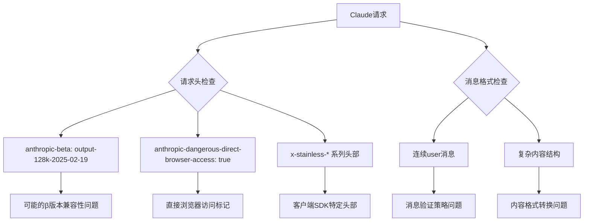
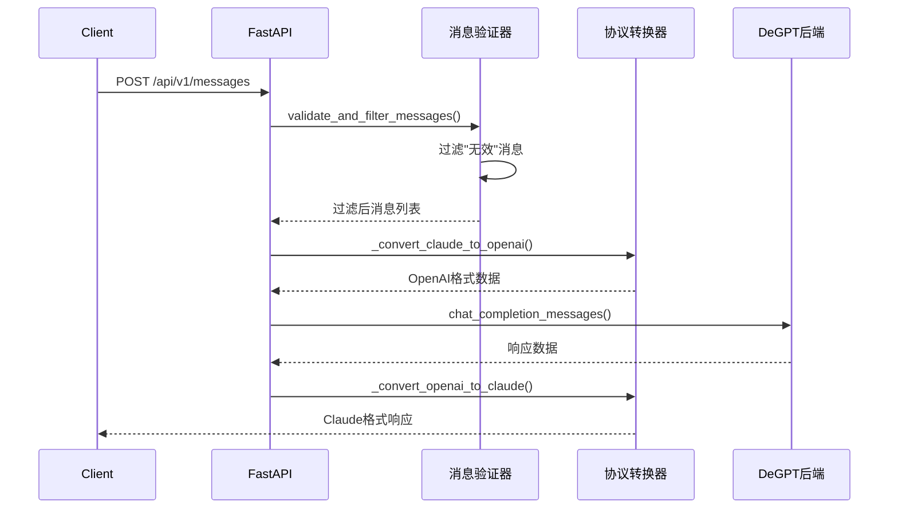
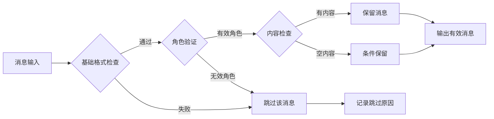
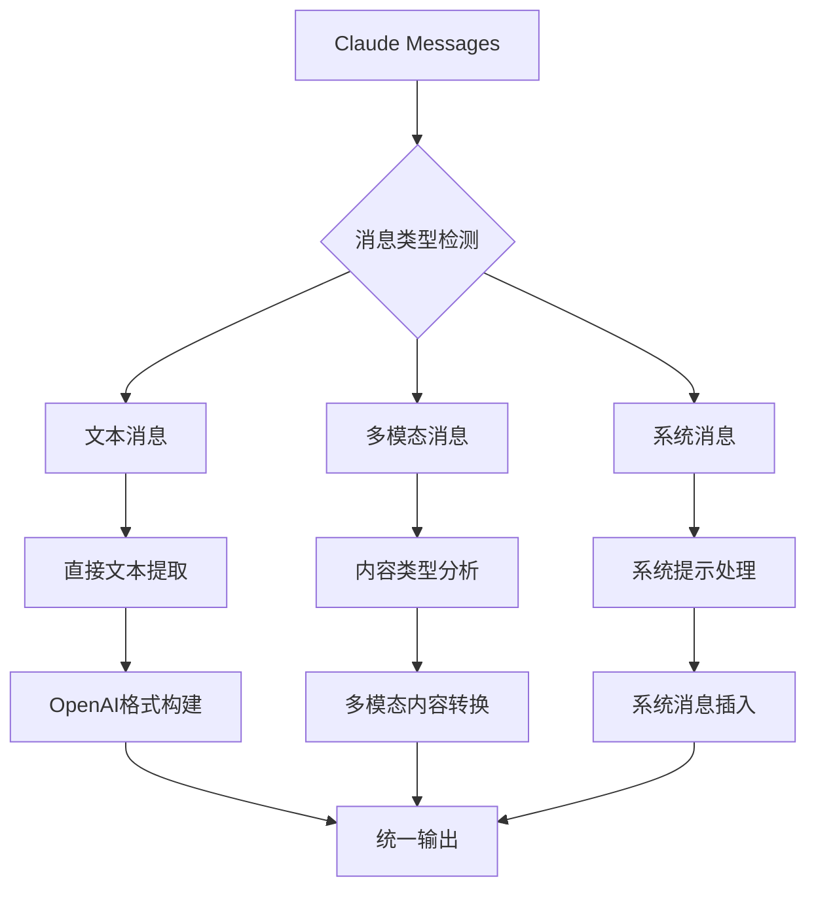
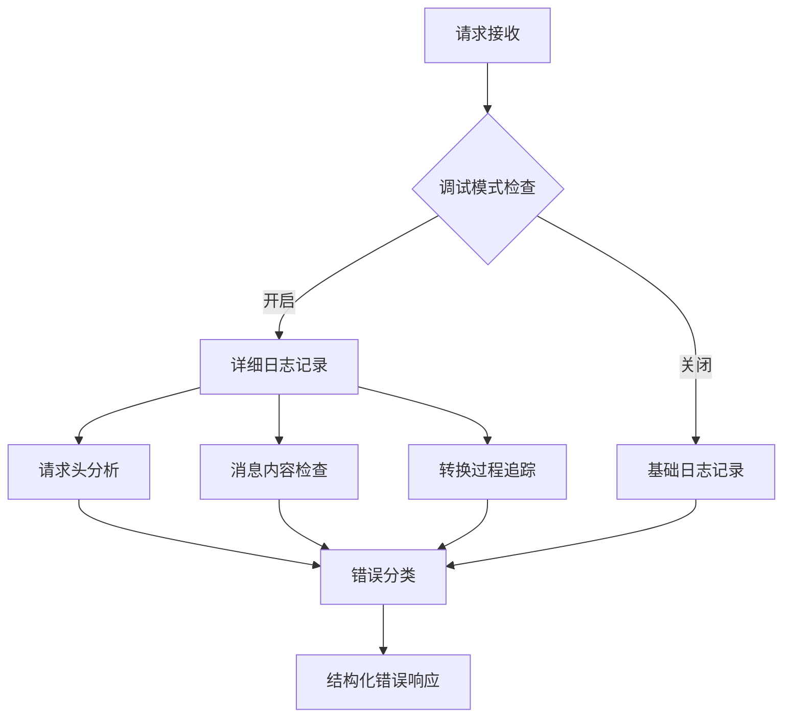
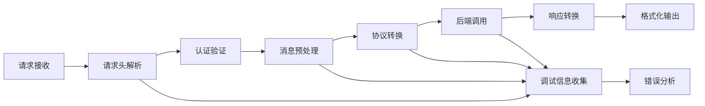

# Claude API 调试设计文档

## 概述

本文档针对 de-github 服务中 Claude API 请求失败的问题进行分析和设计解决方案。项目是一个 API 代理服务，提供 OpenAI 和 Claude 协议的兼容支持，但在处理特定 Claude 格式请求时出现失败。

## 问题分析

### 失败请求特征分析

基于提供的失败请求，识别出以下关键问题点：



### 核心问题识别

1. **消息验证过度严格**：连续的 user 角色消息被误判为无效
2. **请求头处理不完整**：未处理 Anthropic 特有的请求头
3. **内容格式转换缺陷**：复杂嵌套内容结构转换失败
4. **会话管理干扰**：过度的会话ID生成可能影响处理流程

## 架构设计

### 当前处理流程



### 问题定位

| 组件 | 问题描述 | 影响级别 |
|------|----------|----------|
| 消息验证器 | 连续相同角色消息被错误过滤 | 高 |
| 协议转换器 | 复杂内容结构解析不完整 | 中 |
| 请求头处理 | Anthropic特有头部未处理 | 低 |
| 错误处理 | 调试信息不足，难以定位问题 | 中 |

## 解决方案设计

### 1. 消息验证策略优化

#### 当前实现问题
```python
# 现有代码问题：过度过滤连续相同角色消息
def validate_and_filter_messages(self, messages: List[Dict]) -> List[Dict]:
    # 当前实现可能错误过滤连续user消息
```

#### 优化设计


### 2. 协议转换增强

#### Claude到OpenAI转换优化


### 3. 请求头兼容性处理

#### Anthropic特有头部支持
| 头部名称 | 用途 | 处理策略 |
|----------|------|----------|
| anthropic-version | API版本控制 | 记录并透传 |
| anthropic-beta | β功能标识 | 条件处理 |
| anthropic-dangerous-direct-browser-access | 浏览器直接访问 | 安全检查 |
| x-stainless-* | SDK标识信息 | 记录用于分析 |

### 4. 错误处理和调试增强

#### 分层错误处理机制


## 实现方案

### 消息验证器改进

#### 修改策略
1. **放宽连续消息限制**：允许连续相同角色的消息
2. **增强内容验证**：重点验证内容结构而非角色序列
3. **条件性过滤**：仅在内容完全无效时才过滤消息

#### 验证规则表
| 检查项 | 当前规则 | 新规则 | 理由 |
|--------|----------|--------|------|
| 连续user消息 | 严格禁止 | 允许 | Claude支持多轮user输入 |
| 空content | 完全过滤 | 条件保留 | 某些场景需要空消息占位 |
| 嵌套content | 简单处理 | 深度解析 | 支持复杂多模态内容 |

### 协议转换优化

#### 内容结构处理
```python
def _convert_claude_messages_enhanced(self, claude_messages: List[Dict]) -> List[Dict]:
    """增强的Claude消息转换，支持复杂内容结构"""
    # 处理嵌套内容数组
    # 支持多模态内容
    # 保持消息完整性
```

#### 转换映射表
| Claude字段 | OpenAI字段 | 转换逻辑 | 注意事项 |
|------------|------------|----------|----------|
| content[].text | content | 文本提取合并 | 保持换行格式 |
| content[].image_url | content | 多模态转换 | 验证图片格式 |
| thinking | 自定义扩展 | 条件保留 | DeepSeek特有 |
| system | messages[0] | 前置插入 | 角色转换 |

### 请求处理流程重构

#### 新的处理管道


## 调试和监控

### 调试信息增强

#### 分级日志设计
```python
# DEBUG级别：详细的请求处理过程
# INFO级别：关键节点信息
# ERROR级别：异常和错误详情
```

#### 关键监控点
1. **请求解析阶段**：记录原始请求数据
2. **消息验证阶段**：记录过滤前后的消息对比
3. **协议转换阶段**：记录转换前后的数据结构
4. **后端调用阶段**：记录实际发送的请求和收到的响应

### 测试用例扩展

#### 针对性测试场景
| 测试类型 | 场景描述 | 预期结果 |
|----------|----------|----------|
| 连续消息 | 多个连续user消息 | 成功处理 |
| 复杂内容 | 嵌套内容结构 | 正确解析 |
| 特殊头部 | Anthropic特有头部 | 兼容处理 |
| 边界情况 | 空消息、超长消息 | 优雅处理 |

## 部署和验证

### 部署检查清单
- [ ] 消息验证逻辑更新
- [ ] 协议转换器增强
- [ ] 错误处理改进
- [ ] 调试日志配置
- [ ] 测试用例验证

### 验证方法
1. **单元测试**：验证各组件功能
2. **集成测试**：端到端请求处理
3. **压力测试**：高并发场景验证
4. **兼容性测试**：多种客户端适配

### 性能影响评估
| 组件 | 改动类型 | 性能影响 | 优化策略 |
|------|----------|----------|----------|
| 消息验证 | 逻辑优化 | 轻微提升 | 减少不必要过滤 |
| 协议转换 | 功能增强 | 轻微下降 | 缓存转换结果 |
| 错误处理 | 信息增强 | 可忽略 | 异步日志记录 |

## 风险评估

### 潜在风险
1. **向后兼容性**：新的验证逻辑可能影响现有客户端
2. **性能影响**：增强的处理逻辑可能增加延迟
3. **调试信息泄露**：详细日志可能包含敏感信息

### 风险缓解
1. **渐进式部署**：先在测试环境验证
2. **开关控制**：通过环境变量控制新功能
3. **安全过滤**：敏感信息脱敏处理

### 回滚策略
1. **配置回滚**：通过环境变量快速切换到旧逻辑
2. **代码回滚**：保留原有实现作为备份
3. **监控告警**：实时监控错误率和响应时间