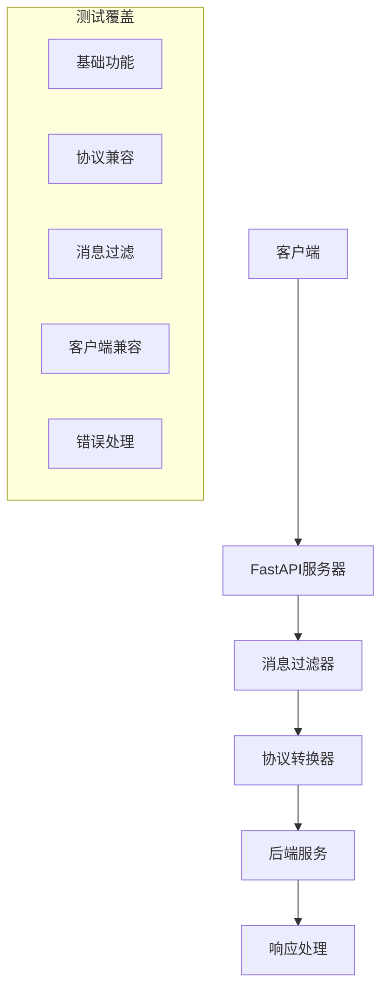

# 服务测试设计文档

## 概述

本文档为de-github项目定义了全面的服务测试策略，确保系统在各种场景下的稳定性、兼容性和功能完整性。

### 核心测试目标
- **功能完整性**：验证所有API端点正常工作
- **协议兼容性**：确保OpenAI和Claude协议完全支持
- **消息过滤**：验证无效消息的正确处理
- **客户端兼容性**：确保主流客户端正常工作
- **错误处理**：验证异常情况的稳定处理

## 技术架构

### 系统测试架构



## 现有test.sh脚本测试指导

您的项目已经包含了一个非常完整的test.sh脚本，包含了12个主要测试类别，共50+个测试用例。

### 当前test.sh脚本特点

#### ✅ **完整的测试覆盖**
- **OpenAI协议测试**: 文本对话、多模态、流式响应
- **Claude协议测试**: 基础对话、thinking参数、工具使用、提示缓存
- **消息过滤测试**: 无效消息处理、边界条件
- **客户端兼容性**: Cherry Studio、标准cURL、Python requests
- **流式响应验证**: SSE格式、事件序列
- **错误处理测试**: 空消息、无效参数、边界条件
- **性能测试**: 长消息、并发请求

### 快速开始测试

#### 1. 准备环境
```bash
# 确保服务正在运行
docker run -d --name de-github -p 7860:7860 -m 2g -e DEBUG=true de:latest

# 等待服务启动
sleep 10

# 验证服务健康状态
curl -s http://localhost:7860/health
```

#### 2. 配置API密钥
```bash
# 在test.sh文件中修改这些变量
OPENAI_API_KEY="your_actual_openai_key"      # 替换为真实密钥
ANTHROPIC_API_KEY="your_actual_anthropic_key" # 替换为真实密钥
```

#### 3. 执行完整测试
```bash
# 给脚本执行权限
chmod +x test.sh

# 运行完整测试套件
./test.sh
```

### 关键测试用例选择

如果您不想执行所有测试，可以专注于这些关键测试：

```bash
#!/bin/bash
# critical_tests.sh - 关键测试用例

API_URL="http://localhost:7860"
OPENAI_API_KEY="your_key"
ANTHROPIC_API_KEY="your_key"

echo "🚀 执行关键测试用例..."

# 1. 健康检查
echo "\n=== 健康检查 ==="
curl -s $API_URL/health

# 2. OpenAI基础对话
echo "\n=== OpenAI基础对话 ==="
curl -s -X POST $API_URL/v1/chat/completions \
  -H 'Content-Type: application/json' \
  -H "Authorization: Bearer $OPENAI_API_KEY" \
  -d '{
    "model": "auto",
    "messages": [{"role": "user", "content": "你好"}],
    "stream": false
  }'

# 3. Claude基础对话
echo "\n=== Claude基础对话 ==="
curl -s -X POST $API_URL/api/v1/messages \
  -H 'Content-Type: application/json' \
  -H "x-api-key: $ANTHROPIC_API_KEY" \
  -H 'anthropic-version: 2023-06-01' \
  -d '{
    "model": "claude-3-haiku-20240307",
    "max_tokens": 1000,
    "messages": [{"role": "user", "content": "你好"}]
  }'

# 4. 消息过滤测试
echo "\n=== 消息过滤测试 ==="
curl -s -X POST $API_URL/v1/chat/completions \
  -H 'Content-Type: application/json' \
  -H "Authorization: Bearer $OPENAI_API_KEY" \
  -d '{
    "model": "auto",
    "messages": [
      {"content": "缺少role字段"},
      {"role": "user", "content": "有效消息"}
    ]
  }'

# 5. Cherry Studio兼容性
echo "\n=== Cherry Studio兼容性 ==="
curl -s $API_URL/v1/chat/completions \
  -H 'User-Agent: CherryStudio/1.5.7' \
  -H "authorization: Bearer $OPENAI_API_KEY" \
  -H 'content-type: application/json' \
  -d '{
    "model": "auto",
    "messages": [{"role": "user", "content": "你好"}]
  }'

echo "\n✅ 关键测试执行完成！"
```

## 自动化测试脚本

### 1. 基础功能测试

#### 健康检查
```bash
curl -s http://localhost:7860/health
# 预期: {"status": "working"}
```

#### 模型列表
```bash
curl -s http://localhost:7860/v1/models \
  -H 'Authorization: Bearer $API_KEY'
# 预期: {"object": "list", "data": [...]}
```

### 2. OpenAI协议测试

#### 基础对话
```bash
curl -s -X POST http://localhost:7860/v1/chat/completions \
  -H 'Content-Type: application/json' \
  -H 'Authorization: Bearer $API_KEY' \
  -d '{
    "model": "auto",
    "messages": [{"role": "user", "content": "你好"}],
    "stream": false
  }'
```

#### 流式响应
```bash
curl -s -X POST http://localhost:7860/v1/chat/completions \
  -H 'Content-Type: application/json' \
  -H 'Authorization: Bearer $API_KEY' \
  -d '{
    "model": "auto",
    "messages": [{"role": "user", "content": "你好"}],
    "stream": true
  }'
```

### 3. Claude协议测试

#### 基础对话
```bash
curl -s -X POST http://localhost:7860/api/v1/messages \
  -H 'Content-Type: application/json' \
  -H 'x-api-key: $ANTHROPIC_API_KEY' \
  -H 'anthropic-version: 2023-06-01' \
  -d '{
    "model": "claude-3-haiku-20240307",
    "max_tokens": 1000,
    "messages": [{"role": "user", "content": "你好"}]
  }'
```

#### Thinking功能
```bash
curl -s -X POST http://localhost:7860/api/v1/messages \
  -H 'Content-Type: application/json' \
  -H 'x-api-key: $ANTHROPIC_API_KEY' \
  -H 'anthropic-version: 2023-06-01' \
  -d '{
    "model": "claude-3-sonnet-20240229",
    "max_tokens": 1000,
    "thinking": {"type": "enabled"},
    "messages": [{"role": "user", "content": "计算问题"}]
  }'
```

### 4. 消息过滤测试

#### 无效消息过滤
```bash
# 缺少role字段
curl -s -X POST http://localhost:7860/v1/chat/completions \
  -H 'Content-Type: application/json' \
  -H 'Authorization: Bearer $API_KEY' \
  -d '{
    "model": "auto",
    "messages": [
      {"content": "无role字段"},
      {"role": "user", "content": "有效消息"}
    ]
  }'

# 空content
curl -s -X POST http://localhost:7860/v1/chat/completions \
  -H 'Content-Type: application/json' \
  -H 'Authorization: Bearer $API_KEY' \
  -d '{
    "model": "auto",
    "messages": [
      {"role": "user", "content": ""},
      {"role": "user", "content": "有效消息"}
    ]
  }'
```

### 5. 客户端兼容性测试

#### Cherry Studio兼容性
```bash
curl -s http://localhost:7860/v1/chat/completions \
  -H 'User-Agent: CherryStudio/1.5.7' \
  -H 'authorization: Bearer $API_KEY' \
  -H 'content-type: application/json' \
  -H 'x-stainless-retry-count: 0' \
  -H 'x-title: Cherry Studio' \
  -d '{
    "model": "auto",
    "messages": [{"role": "user", "content": "你好"}],
    "stream_options": {"include_usage": true}
  }'
```

## 自动化测试脚本

### 增强版测试脚本
```bash
#!/bin/bash
# enhanced_test.sh - 完整服务测试

API_URL="http://localhost:7860"
OPENAI_API_KEY="${OPENAI_API_KEY:-test_key}"
ANTHROPIC_API_KEY="${ANTHROPIC_API_KEY:-test_key}"

TOTAL_TESTS=0
PASSED_TESTS=0
FAILED_TESTS=0

# 日志函数
log_info() { echo -e "\033[32m[INFO]\033[0m $1"; }
log_error() { echo -e "\033[31m[ERROR]\033[0m $1"; }

# 测试函数
run_test() {
    local test_name="$1"
    local test_command="$2"
    local expected_pattern="$3"
    
    TOTAL_TESTS=$((TOTAL_TESTS + 1))
    echo "========== 测试 $test_name =========="
    
    local result
    if [[ "$test_command" =~ "stream.*true" ]]; then
        result=$(timeout 10s bash -c "$test_command" 2>&1 | head -10)
    else
        result=$(timeout 10s bash -c "$test_command" 2>&1)
    fi
    
    echo "$result"
    
    if [[ -n "$expected_pattern" ]] && echo "$result" | grep -q "$expected_pattern"; then
        log_info "✅ 测试通过"
        PASSED_TESTS=$((PASSED_TESTS + 1))
    elif [[ -z "$expected_pattern" ]] && ! echo "$result" | grep -qiE "error|fail|invalid"; then
        log_info "✅ 测试通过"
        PASSED_TESTS=$((PASSED_TESTS + 1))
    else
        log_error "❌ 测试失败"
        FAILED_TESTS=$((FAILED_TESTS + 1))
    fi
    echo
}

# 基础功能测试
echo "🚀 开始服务测试..."

run_test "健康检查" \
    "curl -s $API_URL/health" \
    "working"

run_test "模型列表" \
    "curl -s $API_URL/v1/models -H 'Authorization: Bearer $OPENAI_API_KEY'" \
    "data"

run_test "OpenAI基础对话" \
    "curl -s -X POST $API_URL/v1/chat/completions -H 'Content-Type: application/json' -H 'Authorization: Bearer $OPENAI_API_KEY' -d '{\"model\": \"auto\", \"messages\": [{\"role\": \"user\", \"content\": \"你好\"}], \"stream\": false}'" \
    "choices"

run_test "Claude基础对话" \
    "curl -s -X POST $API_URL/api/v1/messages -H 'Content-Type: application/json' -H 'x-api-key: $ANTHROPIC_API_KEY' -H 'anthropic-version: 2023-06-01' -d '{\"model\": \"claude-3-haiku-20240307\", \"max_tokens\": 1000, \"messages\": [{\"role\": \"user\", \"content\": \"你好\"}]}'" \
    "content"

# 消息过滤测试
run_test "消息过滤-缺少role" \
    "curl -s -X POST $API_URL/v1/chat/completions -H 'Content-Type: application/json' -H 'Authorization: Bearer $OPENAI_API_KEY' -d '{\"model\": \"auto\", \"messages\": [{\"content\": \"无role\"}, {\"role\": \"user\", \"content\": \"有效\"}]}'"

run_test "消息过滤-空content" \
    "curl -s -X POST $API_URL/v1/chat/completions -H 'Content-Type: application/json' -H 'Authorization: Bearer $OPENAI_API_KEY' -d '{\"model\": \"auto\", \"messages\": [{\"role\": \"user\", \"content\": \"\"}, {\"role\": \"user\", \"content\": \"有效\"}]}'"

# Claude高级功能
run_test "Claude thinking" \
    "curl -s -X POST $API_URL/api/v1/messages -H 'Content-Type: application/json' -H 'x-api-key: $ANTHROPIC_API_KEY' -H 'anthropic-version: 2023-06-01' -d '{\"model\": \"claude-3-sonnet-20240229\", \"max_tokens\": 1000, \"thinking\": {\"type\": \"enabled\"}, \"messages\": [{\"role\": \"user\", \"content\": \"思考\"}]}'"

run_test "Claude未知参数" \
    "curl -s -X POST $API_URL/api/v1/messages -H 'Content-Type: application/json' -H 'x-api-key: $ANTHROPIC_API_KEY' -H 'anthropic-version: 2023-06-01' -d '{\"model\": \"claude-3-haiku-20240307\", \"max_tokens\": 1000, \"unknown_param\": \"ignored\", \"messages\": [{\"role\": \"user\", \"content\": \"测试\"}]}'"

# 客户端兼容性
run_test "Cherry Studio兼容" \
    "curl -s $API_URL/v1/chat/completions -H 'User-Agent: CherryStudio/1.5.7' -H 'authorization: Bearer $OPENAI_API_KEY' -H 'content-type: application/json' -d '{\"model\": \"auto\", \"messages\": [{\"role\": \"user\", \"content\": \"你好\"}]}'"

# 流式响应
run_test "OpenAI流式" \
    "curl -s -X POST $API_URL/v1/chat/completions -H 'Content-Type: application/json' -H 'Authorization: Bearer $OPENAI_API_KEY' -d '{\"model\": \"auto\", \"messages\": [{\"role\": \"user\", \"content\": \"测试\"}], \"stream\": true}'" \
    "data:"

run_test "Claude流式" \
    "curl -s -X POST $API_URL/api/v1/messages -H 'Content-Type: application/json' -H 'x-api-key: $ANTHROPIC_API_KEY' -H 'anthropic-version: 2023-06-01' -d '{\"model\": \"claude-3-haiku-20240307\", \"max_tokens\": 500, \"stream\": true, \"messages\": [{\"role\": \"user\", \"content\": \"测试\"}]}'" \
    "event:"

# 错误处理
run_test "空消息列表" \
    "curl -s -X POST $API_URL/v1/chat/completions -H 'Content-Type: application/json' -H 'Authorization: Bearer $OPENAI_API_KEY' -d '{\"model\": \"auto\", \"messages\": []}'"

# 测试统计
echo "========================================="
echo "🎯 测试结果统计"
echo "========================================="
echo "总测试数: $TOTAL_TESTS"
echo "通过测试: $PASSED_TESTS"
echo "失败测试: $FAILED_TESTS"

if [ $TOTAL_TESTS -gt 0 ]; then
    success_rate=$(( PASSED_TESTS * 100 / TOTAL_TESTS ))
    echo "成功率: ${success_rate}%"
    
    if [ $success_rate -ge 90 ]; then
        log_info "🎉 测试表现优秀！"
    elif [ $success_rate -ge 80 ]; then
        echo "⚠️  测试表现良好，建议改进失败用例"
    else
        log_error "❌ 测试表现需要改进"
    fi
fi

if [ $FAILED_TESTS -eq 0 ]; then
    echo "✅ 所有测试通过，服务运行正常"
    exit 0
else
    echo "⚠️  发现失败测试，建议检查："
    echo "   - 服务配置是否正确"
    echo "   - API密钥是否有效"
    echo "   - 网络连接是否正常"
    exit 1
fi
```

### 快速验证脚本
```bash
#!/bin/bash
# quick_verify.sh - 快速服务验证

API_URL="http://localhost:7860"
API_KEY="${API_KEY:-test_key}"

echo "🔍 快速验证服务状态..."

# 健康检查
if curl -s $API_URL/health | grep -q "working"; then
    echo "✅ 服务健康检查通过"
else
    echo "❌ 服务健康检查失败"
    exit 1
fi

# 基础API测试
response=$(curl -s -X POST $API_URL/v1/chat/completions \
  -H 'Content-Type: application/json' \
  -H 'Authorization: Bearer $API_KEY' \
  -d '{"model": "auto", "messages": [{"role": "user", "content": "test"}]}')

if echo "$response" | grep -q "choices"; then
    echo "✅ OpenAI API 测试通过"
else
    echo "❌ OpenAI API 测试失败"
fi

echo "🎉 快速验证完成！"
```

## 部署和CI/CD集成

### Docker测试环境
```bash
# 构建和测试流程
docker build --no-cache --compress -t de-test .
docker run -d --name de-test -p 7860:7860 -m 2g -e DEBUG=true de-test
sleep 10
bash enhanced_test.sh
docker stop de-test && docker rm de-test
```

### GitHub Actions集成
```yaml
name: Service Testing

on:
  push:
    branches: [ main ]
  pull_request:
    branches: [ main ]

jobs:
  test:
    runs-on: ubuntu-latest
    
    steps:
    - uses: actions/checkout@v3
    
    - name: Build Docker image
      run: docker build --no-cache -t de-test .
    
    - name: Start service
      run: |
        docker run -d --name de-test -p 7860:7860 -m 2g de-test
        sleep 15
    
    - name: Run tests
      run: |
        chmod +x enhanced_test.sh
        ./enhanced_test.sh
    
    - name: Cleanup
      if: always()
      run: docker stop de-test && docker rm de-test
```

## 性能基准

### 性能指标
- **响应时间**: 95%的请求应在5秒内完成
- **并发处理**: 支持至少10个并发连接
- **内存使用**: 运行时内存不超过2GB
- **成功率**: API调用成功率应超过99%

### 监控实现
```bash
# 性能监控脚本
#!/bin/bash
echo "📊 性能监控开始..."

# 响应时间测试
for i in {1..10}; do
    start_time=$(date +%s.%N)
    curl -s -X POST http://localhost:7860/v1/chat/completions \
        -H 'Content-Type: application/json' \
        -H 'Authorization: Bearer test_key' \
        -d '{"model": "auto", "messages": [{"role": "user", "content": "性能测试"}]}' > /dev/null
    end_time=$(date +%s.%N)
    response_time=$(echo "$end_time - $start_time" | bc)
    echo "请求 $i: ${response_time}s"
done

# 并发测试
echo "测试并发处理..."
for i in {1..5}; do
    curl -s -X POST http://localhost:7860/v1/chat/completions \
        -H 'Content-Type: application/json' \
        -H 'Authorization: Bearer test_key' \
        -d '{"model": "auto", "messages": [{"role": "user", "content": "并发测试'$i'"}]}' &
done
wait
echo "并发测试完成"
```

## 执行现有test.sh的完整指南

### 准备工作

#### 1. 环境检查
```bash
# 检查必要工具
command -v docker >/dev/null || echo "❌ 需要安装Docker"
command -v curl >/dev/null || echo "❌ 需要安装curl"
command -v jq >/dev/null || echo "❌ 需要安装jq（用于JSON格式化）"

# 安装jq（如果缺失）
# Ubuntu/Debian: sudo apt-get install jq
# macOS: brew install jq
# CentOS/RHEL: sudo yum install jq
```

#### 2. 服务启动
```bash
# 方法1：使用预构建镜像
docker run -d --name de-test -p 7860:7860 -m 2g -e DEBUG=true ghcr.io/hhhaiai/de:latest

# 方法2：本地构建
docker build --no-cache --compress -t de .
docker run -d --name de-test -p 7860:7860 -m 2g -e DEBUG=true de

# 等待服务启动（重要！）
echo "等待服务启动..."
sleep 15

# 验证服务状态
curl -s http://localhost:7860/health
```

#### 3. 配置API密钥
```bash
# 编辑test.sh配置
vim test.sh

# 根据实际情况修改：
# OPENAI_API_KEY="your_actual_openai_key"      # 可选
# ANTHROPIC_API_KEY="your_actual_anthropic_key" # 可选
# 
# 注意：如果服务未设置TOKEN环境变量，可以使用任意值
```

### 执行测试

#### 完整测试执行
```bash
# 给脚本执行权限
chmod +x test.sh

# 执行完整测试
./test.sh > test_results.log 2>&1

# 实时查看测试进度
tail -f test_results.log
```

#### 分步骤测试
```bash
# 1. 先测试基础功能
echo "测试健康检查..."
curl -s http://localhost:7860/health

echo "测试模型列表..."
curl -s http://localhost:7860/v1/models -H 'Authorization: Bearer test_key'

# 2. 测试基础对话
echo "测试OpenAI基础对话..."
curl -s -X POST http://localhost:7860/v1/chat/completions \
  -H 'Content-Type: application/json' \
  -H 'Authorization: Bearer test_key' \
  -d '{"model": "auto", "messages": [{"role": "user", "content": "你好"}], "stream": false}'

# 3. 如果基础功能正常，再执行完整测试
./test.sh
```

### 测试结果分析

#### 成功的测试输出示例
```bash
===============================================
测试 OpenAI 文本对话 - 非流式
===============================================
{
  "id": "chatcmpl-abc123",
  "object": "chat.completion",
  "created": 1704672000,
  "model": "gpt-4o-mini",
  "choices": [
    {
      "index": 0,
      "message": {
        "role": "assistant",
        "content": "你好！我是一个AI助手..."
      },
      "finish_reason": "stop"
    }
  ],
  "usage": {
    "prompt_tokens": 10,
    "completion_tokens": 20,
    "total_tokens": 30
  }
}
```

#### 消息过滤成功示例
```bash
===============================================
测试 消息过滤-混合消息类型
===============================================
{
  "choices": [
    {
      "message": {
        "content": "我收到了你的有效消息..."
      }
    }
  ]
}
# 表示服务正确过滤了无效消息，只处理了有效的消息
```

#### Cherry Studio兼容性成功示例
```bash
===============================================
测试 客户端兼容-Cherry Studio流式
===============================================
data: {"id": "chatcmpl-xyz", "object": "chat.completion.chunk", ...}
data: {"id": "chatcmpl-xyz", "object": "chat.completion.chunk", ...}
data: [DONE]
# 表示Cherry Studio客户端请求得到正确处理
```

### 常见问题排查

#### 问题1：服务连接失败
```bash
# 症状
curl: (7) Failed to connect to localhost port 7860: Connection refused

# 排查步骤
1. 检查容器状态
docker ps | grep de-test

2. 检查容器日志
docker logs de-test

3. 检查端口映射
docker port de-test

4. 重启容器
docker restart de-test
sleep 10
```

#### 问题2：认证相关错误
```bash
# 症状
{"error": {"message": "Unauthorized", "type": "invalid_request_error"}}

# 排查步骤
1. 检查TOKEN环境变量
docker exec de-test env | grep TOKEN

2. 如果设置了TOKEN，确保test.sh中的API_KEY匹配
# 或者暂时移除TOKEN限制
docker run -d --name de-test-new -p 7860:7860 -m 2g de  # 不设置TOKEN
```

#### 问题3：模型相关错误
```bash
# 症状
{"error": "Model not available"}

# 排查步骤
1. 检查模型列表
curl -s http://localhost:7860/v1/models

2. 在test.sh中使用"auto"模型
# 将固定模型名改为"auto"
sed -i 's/"gpt-4-turbo"/"auto"/g' test.sh
sed -i 's/"claude-opus-4-20250514"/"claude-3-haiku-20240307"/g' test.sh
```

#### 问题4：Claude协议路径错误
```bash
# 症状
404 Not Found for /v1/messages

# 解决方案
# 在test.sh中将Claude协议路径修改为正确的路径
sed -i 's|/v1/messages|/api/v1/messages|g' test.sh
```

### 测试输出优化

#### 添加测试统计
```bash
#!/bin/bash
# 在test.sh末尾添加统计功能

TOTAL_TESTS=0
PASSED_TESTS=0
FAILED_TESTS=0

# 修改run_test函数
run_test() {
    TOTAL_TESTS=$((TOTAL_TESTS + 1))
    echo "==============================================="
    echo "测试 $1 ($TOTAL_TESTS)"
    echo "==============================================="
    
    result=$(eval "$2" 2>&1)
    echo "$result"
    
    # 简单的成功判断
    if echo "$result" | grep -qE '"choices"|"content"|"working"|"data"'; then
        echo "✅ 测试通过"
        PASSED_TESTS=$((PASSED_TESTS + 1))
    else
        echo "❌ 测试失败"
        FAILED_TESTS=$((FAILED_TESTS + 1))
    fi
    echo -e "\n\n"
}

# 在脚本末尾添加
echo "========================================="
echo "测试总结"
echo "========================================="
echo "总测试数: $TOTAL_TESTS"
echo "通过: $PASSED_TESTS"
echo "失败: $FAILED_TESTS"
echo "成功率: $(( PASSED_TESTS * 100 / TOTAL_TESTS ))%"
```

#### 并行执行优化
```bash
# 对于非依赖的测试，可以并行执行
run_parallel_tests() {
    echo "并行执行基础功能测试..."
    
    # 健康检查
    curl -s http://localhost:7860/health > health_result.txt &
    
    # 模型列表
    curl -s http://localhost:7860/v1/models -H 'Authorization: Bearer test_key' > models_result.txt &
    
    # 等待所有后台任务完成
    wait
    
    echo "健康检查结果:"
    cat health_result.txt
    echo "\n模型列表结果:"
    cat models_result.txt
    
    # 清理临时文件
    rm -f health_result.txt models_result.txt
}
```

### 自动化测试脚本

#### 一键测试脚本
```bash
#!/bin/bash
# auto_test.sh - 自动化测试执行脚本

set -e  # 遇到错误立即退出

echo "🚀 开始自动化测试流程"

# 1. 环境检查
command -v docker >/dev/null || { echo "❌ Docker未安装"; exit 1; }
command -v curl >/dev/null || { echo "❌ curl未安装"; exit 1; }

# 2. 清理旧环境
echo "🧹 清理旧测试环境"
docker stop de-test 2>/dev/null || true
docker rm de-test 2>/dev/null || true

# 3. 启动服务
echo "🏗️  启动测试服务"
docker run -d --name de-test -p 7860:7860 -m 2g -e DEBUG=true ghcr.io/hhhaiai/de:latest

# 4. 等待服务就绪
echo "⏳ 等待服务启动"
sleep 15

# 5. 验证服务状态
for i in {1..5}; do
    if curl -s http://localhost:7860/health | grep -q "working"; then
        echo "✅ 服务就绪"
        break
    fi
    if [ $i -eq 5 ]; then
        echo "❌ 服务启动失败"
        docker logs de-test
        exit 1
    fi
    sleep 3
done

# 6. 执行测试
echo "🧪 执行完整测试套件"
chmod +x test.sh
./test.sh > test_results_$(date +%Y%m%d_%H%M%S).log 2>&1
TEST_RESULT=$?

# 7. 显示结果
if [ $TEST_RESULT -eq 0 ]; then
    echo "🎉 所有测试通过！"
else
    echo "⚠️  部分测试失败，请查看日志"
fi

# 8. 清理环境
echo "🧹 清理测试环境"
docker stop de-test
docker rm de-test

echo "✅ 自动化测试完成"
exit $TEST_RESULT
```

执行一键测试：
```bash
chmod +x auto_test.sh
./auto_test.sh
```

## 故障排查指南

### 常见问题和解决方案

#### 1. 服务无法启动
**症状**: 健康检查失败
**排查步骤**:
1. 检查端口占用: `lsof -i :7860`
2. 查看Docker日志: `docker logs <container>`
3. 检查内存限制: 确保至少2GB内存
4. 验证环境变量配置

#### 2. API调用失败
**症状**: 返回4xx或5xx错误
**排查步骤**:
1. 验证API密钥配置
2. 检查请求格式是否正确
3. 查看服务日志获取详细错误
4. 验证模型名称是否支持

#### 3. 流式响应异常
**症状**: 流式响应中断或格式错误
**排查步骤**:
1. 检查网络连接稳定性
2. 验证SSE格式是否正确
3. 检查超时设置
4. 查看后端服务状态

#### 4. 消息过滤问题
**症状**: 有效消息被错误过滤
**排查步骤**:
1. 检查消息格式是否符合规范
2. 验证role和content字段
3. 查看过滤逻辑日志
4. 测试边界条件

### 日志分析
```bash
# 查看关键错误
docker logs de-test 2>&1 | grep -i error

# 查看API调用统计
docker logs de-test 2>&1 | grep -i "model:"

# 查看消息过滤日志
docker logs de-test 2>&1 | grep -i "filter"
```

## 现有test.sh测试分析

### 现有测试脚本概览
您的项目已经包含了一个非常全面的test.sh文件，涵盖了以下测试场景：

#### 测试覆盖范围分析
1. **OpenAI兼容性测试（3个测试组）**
   - 基础文本对话（流式/非流式）
   - 多模态文本对话 
   - 多模态识图+文本对话

2. **Claude兼容性测试（5个测试组）**
   - 基础文本对话（流式/非流式）
   - Claude特殊功能（thinking、工具使用、提示缓存）
   - 增强协议测试（完整参数、未知参数兼容性）

3. **消息过滤功能测试（6个测试用例）**
   - 缺少role/content字段处理
   - 空content和无效role处理
   - 混合消息类型过滤

4. **客户端兼容性测试（4个测试用例）**
   - Cherry Studio客户端完整模拟
   - 标准cURL和Python requests客户端

5. **流式响应格式测试（3个测试用例）**
   - Claude SSE事件序列验证
   - OpenAI stream_options支持

6. **错误处理测试（4个测试用例）**
   - 边界条件和异常参数处理

7. **基础功能测试（2个测试用例）**
   - 健康检查和模型列表

8. **性能测试（2个测试用例）**
   - 长消息处理和并发请求

### 如何执行现有test.sh

#### 1. 准备测试环境
```bash
# 启动服务（如果还未启动）
docker run -d --name de-test -p 7860:7860 -m 2g -e DEBUG=true de

# 等待服务启动
sleep 10

# 验证服务状态
curl -s http://localhost:7860/health
```

#### 2. 配置API密钥
编辑test.sh文件，设置正确的API密钥：
```bash
# 编辑配置
vim test.sh

# 修改以下行：
OPENAI_API_KEY="YOUR_ACTUAL_OPENAI_KEY"      # 替换为实际的OpenAI API Key
ANTHROPIC_API_KEY="YOUR_ACTUAL_ANTHROPIC_KEY" # 替换为实际的Anthropic API Key
```

#### 3. 执行测试
```bash
# 给测试脚本执行权限
chmod +x test.sh

# 执行完整测试套件
./test.sh

# 或者执行特定部分的测试（通过手动注释其他部分）
# 例如只测试基础功能：
# 取消注释第597-607行的健康检查和模型列表测试
./test.sh
```

#### 4. 监控测试输出
测试执行时会显示：
```
===============================================
测试 [测试名称]
===============================================
[测试结果输出]


===============================================
测试 [下一个测试名称]
===============================================
[测试结果输出]
```

### 测试结果判断标准

#### ✅ 成功指标
1. **健康检查**：返回`{"status": "working"}`
2. **模型列表**：返回包含`"data"`字段的JSON
3. **基础对话**：返回包含`"choices"`或`"content"`的响应
4. **消息过滤**：无效消息被过滤，有效消息正常处理
5. **流式响应**：包含`data:`行或`event:`行
6. **错误处理**：边界条件返回合理错误信息

#### ❌ 失败指标
1. **连接错误**：`curl: (7) Failed to connect`
2. **认证错误**：`401 Unauthorized`
3. **格式错误**：响应不包含预期字段
4. **超时错误**：请求超时无响应
5. **服务错误**：`500 Internal Server Error`

### 重要测试用例解析

#### Cherry Studio兼容性测试（关键）
```bash
# 这个测试模拟了真实Cherry Studio客户端的请求
curl -s 'http://localhost:7860/v1/chat/completions' \
  -H 'User-Agent: CherryStudio/1.5.7' \
  -H 'x-stainless-retry-count: 0' \
  -H 'x-title: Cherry Studio' \
  --data-raw '{
    "model":"deepseek-chat",
    "stream_options":{"include_usage":true}
  }'
```
**预期结果**：正常返回对话响应，说明Cherry Studio客户端兼容性良好

#### 消息过滤测试（核心功能）
```bash
# 测试混合有效/无效消息的处理
curl -s -X POST $API_URL/v1/chat/completions \
  -d '{
    "messages": [
      {"role": "system", "content": "你是助手"},  # 有效
      {"content": "无效消息1"},                    # 无效：缺少role
      {"role": "user", "content": "用户消息"},      # 有效
      {"role": "invalid", "content": "无效消息2"}   # 无效：role不合法
    ]
  }'
```
**预期结果**：服务应过滤掉无效消息，仅处理有效的system和user消息

#### Claude thinking参数测试（增强功能）
```bash
# 测试Claude的thinking功能支持
curl -s -X POST $API_URL/v1/messages \
  -d '{
    "model": "claude-opus-4-20250514",
    "thinking": {"type": "enabled"},
    "messages": [{"role": "user", "content": "复杂问题"}]
  }'
```
**预期结果**：系统应正确处理thinking参数（即使只是记录而不透传）

### 测试问题排查

#### 常见问题及解决方案

**问题1：连接被拒绝**
```
curl: (7) Failed to connect to localhost port 7860
```
**解决**：
```bash
# 检查服务是否运行
docker ps | grep de

# 检查端口是否开放
lsof -i :7860

# 重新启动服务
docker restart de-test
```

**问题2：认证失败**
```
{"error": "Unauthorized"}
```
**解决**：
```bash
# 检查环境变量TOKEN是否设置
docker exec de-test env | grep TOKEN

# 或者在test.sh中使用正确的API密钥
```

**问题3：模型不存在错误**
```
{"error": "Model not found"}
```
**解决**：
```bash
# 检查可用模型列表
curl -s http://localhost:7860/v1/models

# 在test.sh中使用"auto"模型或实际支持的模型名
```

**问题4：Cherry Studio测试失败**
```
{"error": "Bad Request"}
```
**解决**：
- 检查请求头是否正确设置
- 验证stream_options参数是否被正确处理
- 查看服务日志获取详细错误信息

### 自定义测试建议

#### 快速验证版本
如果您只想快速验证服务基本功能，可以创建简化版本：
```bash
#!/bin/bash
# quick_test.sh
API_URL="http://localhost:7860"
API_KEY="test_key"

echo "🔍 快速功能验证..."

# 健康检查
echo "1. 健康检查"
curl -s $API_URL/health

# 基础对话
echo -e "\n2. 基础对话测试"
curl -s -X POST $API_URL/v1/chat/completions \
  -H 'Content-Type: application/json' \
  -H 'Authorization: Bearer $API_KEY' \
  -d '{"model": "auto", "messages": [{"role": "user", "content": "你好"}]}'

echo -e "\n✅ 快速验证完成"
```

#### 逐个功能测试
您也可以将test.sh中的测试用例分组执行：
```bash
# 只测试消息过滤功能
grep -A 20 "消息过滤功能测试" test.sh > filter_test.sh
chmod +x filter_test.sh
./filter_test.sh

# 只测试Claude协议
grep -A 30 "Claude 兼容性测试" test.sh > claude_test.sh
chmod +x claude_test.sh
./claude_test.sh
```

### 测试最佳实践

1. **逐步测试**：先运行基础功能测试，再运行复杂功能测试
2. **监控日志**：测试时同时监控服务日志 `docker logs -f de-test`
3. **记录结果**：将测试输出保存到文件 `./test.sh > test_results.log 2>&1`
4. **环境隔离**：使用独立的测试容器，避免影响生产环境
5. **定期执行**：将测试脚本集成到CI/CD流程中

您的test.sh已经非常全面，覆盖了服务的所有核心功能。建议先执行一次完整测试，然后根据结果针对性地调试和优化服务配置。